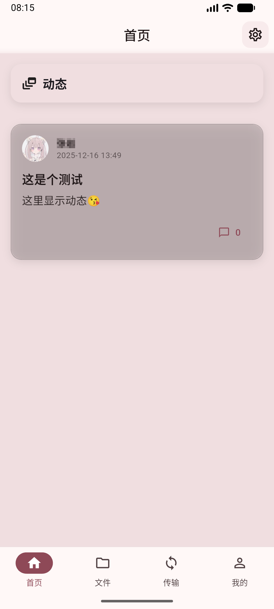
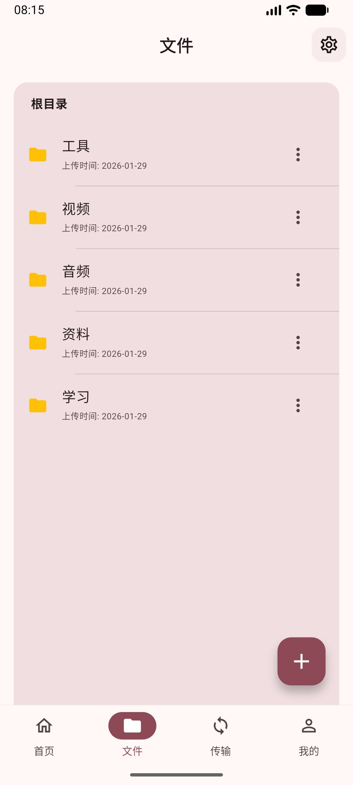
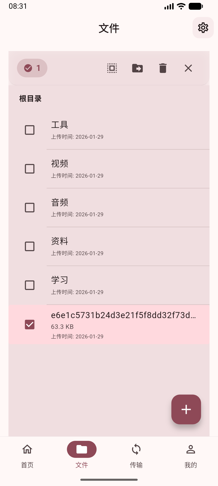
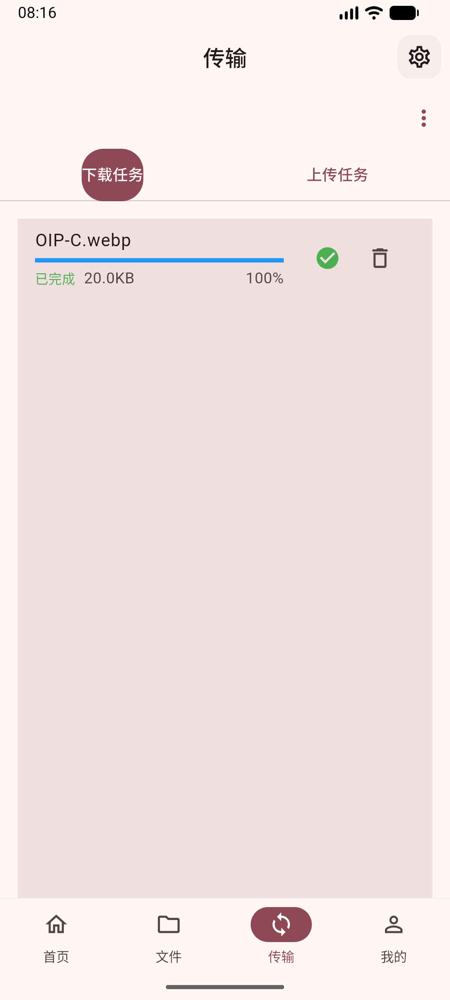
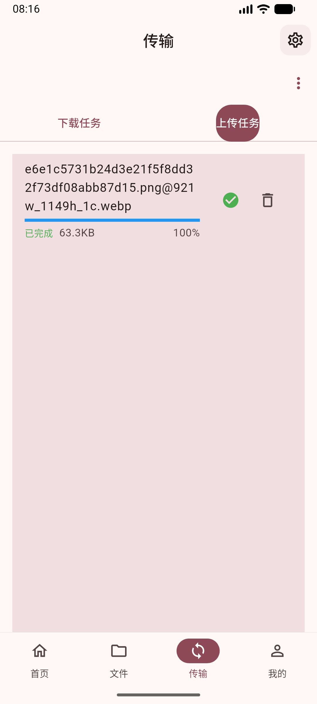
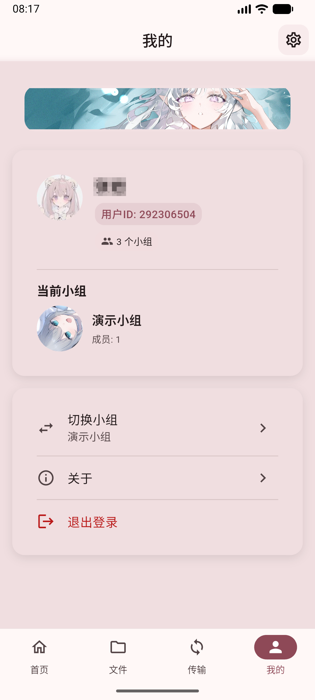

    

    <h1>ChaoxingRC</h1>

    
使用 Flutter 开发的超星网盘第三方客户端

 

 

 

 

## 适配平台

- [x] Android
- [ ] iOS
- [ ] Windows
- [ ] macOS
- [ ] Linux
- [ ] Web

## 功能

- [x] 登录/会话（Cookie）
- [x] 文件浏览（列表/路径导航）
- [x] 上传（支持分片/断点续传，视实现而定）
- [x] 下载（后台下载/进度展示）
- [x] 传输任务管理（队列/失败重试）
- [x] 主题设置（浅色/深色/跟随系统、动态色）
- [x] 自定义壁纸/液态玻璃风格（可选）

## 声明

本项目仅用于学习与研究，请勿用于任何违反服务条款的用途。
